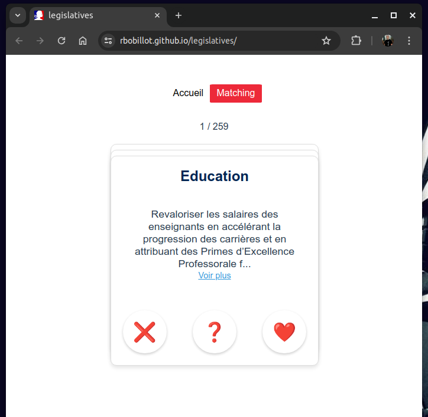

# Polimatch

## What is it ?
A Tinder-like webapp, allowing citizens to match political programs, by voting on decontextualized offers

## UI/UX


## Tech stack
- Vue 3
- Javascript
- Babel
- Github Pages

## Contributing
Feel free to contribute
- UI/UX updates
- Add political offers (sourced, and matching the current offer scheme)

The offers are stored in a local JSON [file](./src/json/offers.json), such as:
```json
{
    "political_parties" : [
        "PARTY_NAME"
    ],
    "offers" : [
        {
            "source" : "SOME_URL",
            "category" : "CATEGORY_NAME",
            "description" : "SOME_DESCRIPTION",
            "political_party" : "PARTY_NAME",
            "candidate" : "SPECIFIC_PARTY_CANDIDATE_NAME"
        }
    ]
}
```